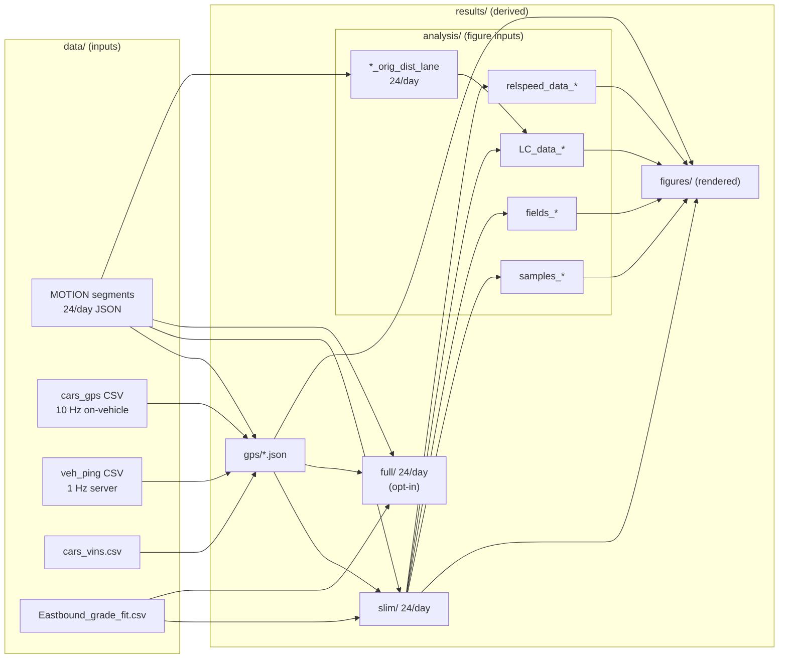

# What is in which file

An inventory of every data file the MVT pipeline reads or writes, with the
columns of each. This is the overview; for the exhaustive per-field tables of
the *processed* products (units, dtype, rounding, field order) see
[DATA_DICTIONARY.md](DATA_DICTIONARY.md).

Units marked **(?)** are not established by the code and need confirming from
the instrument or vehicle documentation. Everything unmarked is either stated
in the code or derivable from it.

---

## Inventory

| File | Where | Count | Size | Written by |
| --- | --- | --- | --- | --- |
| Raw MOTION segments | `data/i24motion/2022-11-DD/` | 24/day (72) | 55 GB | I-24 MOTION observatory |
| On-vehicle GPS/CAN | `data/cars/cars_gps/circles_v2_1_car*.csv` | 1/car | ⎫ 4.5 GB | control vehicles (10 Hz) |
| Server vehicle pings | `data/cars/veh_ping_202211DD.csv` | 1/day | ⎬ | coordination server (1 Hz) |
| VIN map | `data/cars/cars_vins.csv` | 1 | ⎭ | CIRCLES |
| Road grade fit | `MVT_structured_data/Models/Eastbound_grade_fit.csv` | 1 | small | CIRCLES |
| Assembled GPS | `results/gps/CIRCLES_GPS_10Hz_2022-11-DD.json` | 1/day | 821 MB | stage 1 |
| Slim trajectories | `results/slim/2022-11-DD/` | 24/day | 51 GB | stage 2 |
| Full trajectories | `results/full/2022-11-DD/` | 24/day | 81 GB | stage 2 (opt-in) |
| Distance samples | `results/analysis/2022-11-DD/samples_for_distance_analysis_DD.*` | 1/day | 3.9 GB | stage 3 |
| Macroscopic fields | `results/analysis/2022-11-DD/fields_motion_2022-11-DD.*` | 1/day | 46 MB | stage 4 |
| Lane origin/destination | `results/analysis/2022-11-DD/I-24MOTION_*_orig_dist_lane.mat` | 24/day (72) | 3.6 MB | stage 3b |
| Lane-change events | `results/analysis/2022-11-DD/LC_data_DD.mat` | 1/day | 40 MB | stage 3c |
| Pooled relative speeds | `results/analysis/2022-11-DD/relspeed_data_DD.mat` | 1/day | 690 MB | stage 3d |
| Figures | `results/figures/` | many | 207 MB | stages 5, 5b, 6 |
| Provenance sidecar | `results/<product>/dataset_info.json` | 1/product | tiny | every stage |

MATLAB writes `.mat` for the stage 3/4 products; Python writes `.npz` with the
same arrays under the same names. The stage 3b–3d products are MATLAB-only (see
`PYTHON_PORT.md`).

`results/analysis/` holds derived inputs to the figures; `results/figures/`
holds only what is rendered from them. The split is what lets a reader download
the inputs (~5 GB) without the outputs and rebuild the figures. Both are
reproducible from `results/slim/`, and `results/.mvt/` is different again:
build bookkeeping, never published, safe to delete (see the last section).

## How they connect

Only two arrows into `figures/` start at `slim/`: the microscopic trajectory
plots, and nothing else. Everything else a figure needs is in `analysis/` or
`gps/`, which is why the smallest download route works.

Note that `*_orig_dist_lane` is derived from the **raw** MOTION segments, not
from `slim/` — it re-runs the lane clipping to recover what the released data
drops. It is still paired with `slim/` by index, so the two must agree.

`full` is a dead end by design: nothing downstream reads it. It exists for
eastbound plots and as a superset of `slim`.

---

## Raw MOTION segment — `data/i24motion/2022-11-DD/<uuid>__{wed,thu,fri}_0_{00..23}.json`

A JSON array of trajectory records, one per detected vehicle fragment. 10
minutes per file. Positions are in the I-24 MOTION **v2** frame in **feet**,
x increasing eastbound, origin at the Mill Creek Bridge
(`x = 309804.0625 ft`).

**Kept by the pipeline (14):**

- `_id` — object `{$oid}`, MongoDB identifier for the trajectory
- `timestamp` — array, Unix epoch **seconds**, ~25 Hz
- `x_position` — array, **ft**, along-highway position
- `y_position` — array, **ft**, lateral position (sign differs by direction)
- `length`, `width`, `height` — scalar, **ft**, estimated vehicle dimensions
- `coarse_vehicle_class` — int, see [vocabularies](#shared-vocabularies)
- `direction` — int, `-1` westbound, `+1` eastbound
- `local_fragment_id` — nested array, per-node fragment numbering
- `starting_x`, `ending_x` — scalar, **ft**
- `first_timestamp`, `last_timestamp` — scalar, epoch **seconds**

**Dropped immediately by stage 2 (9)** — present in the raw files, absent from
everything downstream, so they are worth mentioning in documentation only as
"recorded but unused":

- `flags` — array of strings: `Anomalous state`, `Exit FOV`, `Lost`, `Overlap`
- `fine_vehicle_class` — int, `-1` throughout the observed sample
- `x_score`, `y_score` — float, tracker confidence (?)
- `merged_ids`, `fragment_ids` — arrays of `{$oid}`, provenance of the merge
- `road_segment_ids` — array of int, `-1` throughout the observed sample
- `compute_node_id` — string, e.g. `videonode4`
- `configuration_id` — int, `-1` throughout the observed sample

## On-vehicle GPS/CAN — `data/cars/cars_gps/circles_v2_1_car*.csv`

10 Hz, recorded **on the vehicle**. Per `data/README.md`, its clock may be
offset from the server's — this is the timing caveat that matters when
comparing against `veh_ping`.

- *(unnamed first column)* — row index from the original export
- `Status` — string; first character is the GPS fix code (`A` = valid). Codes
  above the healthy threshold mark a bad fix and are filtered out
- `Long`, `Lat` — degrees, WGS84
- `Alt` — altitude, **m (?)**
- `Systime` — Unix epoch **seconds**, float
- `vin` — here an integer car number, *not* a VIN string (unlike `veh_ping`)
- `state_x`, `state_y` — projected coordinates in the source CRS (?)
- `rcs_x`, `rcs_y` — **ft**, testbed frame; this is the pair the pipeline uses.
  `y_position` in the assembled GPS is `-rcs_y`
- `can_speed` — speed from the CAN bus, **unit (?)**
- `control_active` — string `"True"`/`"False"`/empty; parsed as the boolean
  `controller_engaged`

Used by the pipeline: `Status`, `Long`, `Lat`, `Systime`, `state_x`, `state_y`,
`rcs_x`, `rcs_y`, `can_speed`, `control_active`.

## Server vehicle pings — `data/cars/veh_ping_202211DD.csv`

~1 Hz, recorded **on the server**, so it may contain outages and transmission
delays. Several headers are truncated to 11 characters by the original export —
`acceleratio`, `relative_le`, `relative_di`, `left_relvel`, `right_relve` —
worth preserving verbatim in documentation, since renaming them breaks the
readers.

- *(unnamed first column)* — row index
- `vin` — VIN string (join key to `cars_vins.csv`)
- `gpstime`, `systime` — Unix epoch **milliseconds** (note: ms here, seconds in
  the on-vehicle file)
- `latitude`, `longitude` — degrees
- `status` — int
- `position`, `velocity`, `acceleratio[n]` — reported kinematics (?)
- `relative_le[ad?]`, `relative_di[stance]` — lead-vehicle measures (?)
- `left_relvel`, `left_yaw`, `right_relve[l]`, `right_yaw` — adjacent-lane
  radar returns (?)
- `acc_speed_setting` — ACC set speed (?); frequently blank
- `acc_status` — ACC engagement state; frequently blank
- `is_wb` — westbound indicator; frequently blank

Used by the pipeline: `vin`, `gpstime`, `latitude`, `longitude`, `status`,
`acc_status`.

## VIN map — `data/cars/cars_vins.csv`

One row per control vehicle. This is the join between the VIN strings in
`veh_ping` and the integer car numbers used elsewhere.

- `vin` — VIN string
- `veh_id` — integer car number (matches the `vin` column of `cars_gps`, and
  `av_id` in the assembled GPS)
- `make`, `model` — e.g. `Nissan`, `Rogue SV FWD`
- `route` — assigned route, e.g. `orange`
- `lane_num` — assigned lane (becomes `assigned_lane`)
- `cohort` — deployment cohort
- `ctrl_allowed` — whether the vehicle was permitted to engage control

## Road grade fit — `Models/Eastbound_grade_fit.csv`

A piecewise-linear fit of eastbound road grade against distance. Stage 2 looks
up the interval containing each position and evaluates
`asin(slope * x/100 + intercept/100)`, negated for westbound — so slope and
intercept are in **percent grade**, and the interval bounds are in **miles**
from the grade map's origin (0.225 mi east of the Mill Creek origin).

- `interval_number` — 1-based index
- `interval_start`, `interval_end` — **miles**
- `slope` — **percent grade per mile**
- `intercept` — **percent grade**

---

## Assembled GPS — `results/gps/CIRCLES_GPS_10Hz_2022-11-DD.json`

One JSON array; one record per control-vehicle **run** (a continuous pass
through the testbed), resampled to a uniform 10 Hz grid. Full field table in
[DATA_DICTIONARY.md](DATA_DICTIONARY.md#assembled-gps-data--resultsgps).

- `av_id` — int, control vehicle number
- `assigned_lane` — int, from the VIN map
- `direction` — int, `-1` west / `+1` east
- `timestamp` — array, epoch **seconds**, exact 10 Hz grid
- `latitude`, `longitude` — arrays, degrees
- `x_position`, `y_position` — arrays, **ft**, testbed frame (`y = -rcs_y`)
- `controller_engaged` — array of **bool**, from `control_active`
- `speed` — array, from CAN, **unit (?)**; derived from position when CAN speed
  is absent for the whole run
- `is_server_connected` — array of int
- `first_timestamp`, `last_timestamp` — scalar, epoch seconds
- `control_car` — array of int, control state per sample
- `control_last30` — array of int, control state over a trailing 30 s window

## Slim trajectories — `results/slim/2022-11-DD/I-24MOTION_*.json`

Westbound only, 31 fields, one 10-minute segment per file. **The released
product**, and the input to stages 3–6. Per-field detail in
[DATA_DICTIONARY.md](DATA_DICTIONARY.md#processed-motion-data--resultsslim-and-resultsfull).

Grouped by role:

- **Identity** — `trajectory_id` (raw `_id` plus a `-N` clip suffix),
  `coarse_vehicle_class`, `length`, `width`, `height`, `energy_model`
- **Time and extent** — `timestamp`, `first_timestamp`, `last_timestamp`,
  `starting_x`, `ending_x`, `total_distance_traversed_meters`
- **Motion** — `x_position_meters`, `y_position_corrected_meters`,
  `speed_meters_per_second`,
  `acceleration_meters_per_second_per_second`, `lane_number`,
  `road_grade_radians`
- **Fuel** — `fuel_rate_grams_per_second`, `percent_infeasibility`,
  `total_fuel_consumed_grams`, `total_fuel_consumed_gallons`,
  `total_fuel_economy_mpg`
- **Distance to control vehicles** (8 fields, downstream positive / upstream
  negative) — `downstream_av_id`, `distance_to_downstream_av_meters`,
  `downstream_engaged_av_id`, `distance_to_downstream_engaged_av_meters`,
  `upstream_engaged_av_id`, `distance_to_upstream_engaged_av_meters`,
  `upstream_av_id`, `distance_to_upstream_av_meters`

Every numeric field is rounded to **4 decimals** before encoding. `NaN` encodes
as `null`; an empty array as `[]` (meaning "no control vehicle was ever
nearby", which is different from a missing sample).

## Full trajectories — `results/full/2022-11-DD/I-24MOTION_*.json`

Everything in `slim`, plus eastbound trajectories and 14 more fields — 45
total. Opt-in; nothing downstream reads it.

Additions over `slim`:

- `direction` — int, `-1` / `+1` (slim is westbound only, so it has no such
  field)
- **Reference trajectory** — a synthetic two-phase constant-acceleration drive
  covering the same distance in the same time, as a counterfactual:
  `reference_a1_meters_per_second_per_second`,
  `reference_a2_meters_per_second_per_second`
- **Flat-road fuel** — the same drive re-evaluated at zero grade:
  `fuel_rate_flat_road_grams_per_second`, `percent_infeasibility_flat_road`,
  `total_fuel_consumed_flat_road_grams`,
  `total_fuel_consumed_flat_road_gallons`, `total_fuel_economy_flat_road_mpg`
- **Reference fuel** — `reference_fuel_rate_grams_per_second`,
  `percent_reference_infeasibility`, `total_reference_fuel_consumed_grams`
- **Reference fuel, flat road** —
  `reference_fuel_rate_flat_road_grams_per_second`,
  `percent_reference_infeasibility_flat_road`,
  `total_reference_fuel_consumed_flat_road_grams`

The four `total_*_grams` fields are the ones computed by compensated
summation for cross-platform reproducibility (data version 2.1.1 — see
[DATA_CHANGELOG.md](DATA_CHANGELOG.md)).

## Distance samples — `samples_for_distance_analysis_DD.{mat,npz}`

Flat, equal-length arrays — one entry per (trajectory, timestep) sample kept
for the fuel-vs-distance analysis. Roughly 89 million samples per day. dtypes
are narrowed deliberately to keep the file manageable.

- `samples_dist` — float64, distance to nearest control vehicle, **m**
- `samples_speed` — float64, **m/s**
- `samples_fr` — float64, fuel rate, **g/s**
- `samples_fcons` — float64, fuel consumption
- `samples_class` — uint8, coarse vehicle class
- `samples_xpos` — int16, position bin
- `samples_lane` — uint8, lane number
- `samples_t` — uint16, time bin

## Macroscopic fields — `fields_motion_2022-11-DD.{mat,npz}`

Traffic-state fields on a time × space grid (2881 × 131 for the standard
settings), one file per day.

- `t` — float64 (2881,), time grid
- `x` — float64 (131,), space grid
- `direction`, `lane` — scalar int, which slice the fields describe
- `field_Rho` — density
- `field_Q` — flow
- `field_U` — speed
- `field_F` — fuel rate
- `field_Phi`, `field_Psi` — derived fuel/energy fields

## Lane origin and destination — `I-24MOTION_<timestamp>_orig_dist_lane.mat`

One per raw segment, 24 per day, named after the slim segment it accompanies.
A single struct array, `dataTemp_lane_orig_dist`, with two fields:

- `origin_lane` — int, the lane the trajectory entered from
- `destination_lane` — int, the lane it left for

**Entry *i* describes released trajectory *i* of the matching slim file.** The
pairing is positional, not by id: the file carries no trajectory identifier, so
it is meaningless without the slim segment of the same name, and the two must
come from the same build. `extract_lane_changes_v_dist_to_av` checks the counts
agree and refuses to run if they do not.

Lane numbering is the released convention: 1 leftmost through 4 rightmost,
0 off the highway, 5 on an on/off ramp.

## Lane-change events — `LC_data_DD.mat`

One per day. Two struct arrays, for merges into a lane and out of it:

- `all_lane_changes_start` — merge-in events, measured at the trajectory's first
  timestamp
- `all_lane_changes_end` — merge-out events, measured at its last

Roughly 160,000–220,000 rows each per day. **Rows are not vehicles**: an event
is emitted once per AV it can be measured against, so one lane change yields two
rows when both an upstream and a downstream AV existed. Fields are listed in
`DATA_DICTIONARY.md`.

## Pooled relative speeds — `relspeed_data_DD.mat`

One per day: every sample of (distance to the nearest downstream engaged AV,
relative speed) that survives filtering, pooled over the day's 24 segments.
About 14 million samples per day.

- `filtered_dist_all_files` — float64, distance to the AV, **m**, within
  `[lower_Bnd, upper_Bnd]`
- `filtered_speed_all_files` — float64, relative speed, **m/s**, positive when
  the gap is opening
- `lower_Bnd`, `upper_Bnd` — the distance bounds the pooling used (30 m, 350 m)
- `j_start`, `j_end` — the segment range pooled (1, 24)
- `day` — 16, 17 or 18

The bounds and segment range travel with the data because the figures are only
comparable across days if the pooling matched.

## Provenance sidecar — `dataset_info.json`

One per product, at the product root (*not* beside the data — a stray `.json`
among the segment files gets swallowed by directory globs).

- `dataset`, `product`, `day`, `files` — what this folder holds
- `data_version` — e.g. `2.1.1`; `version_scheme` explains MAJOR/MINOR/PATCH
- `generated_utc` — taken from the newest output, not the clock
- `generated_by` — implementation, MATLAB/Python version, platform, host, user,
  and `code_commit`
- `copyright`, `license`, `documentation`, `upstream_motion_data`

Deliberately **not** byte-reproducible, and excluded from the checksum
manifests.

---

## Shared vocabularies

Values that recur across files and are worth putting on any diagram once.

**`coarse_vehicle_class`** (raw MOTION, carried through to slim/full), and the
fuel model each maps to:

| Value | Meaning | Energy model |
| --- | --- | --- |
| 0 | sedan | `midBase` |
| 1 | midsize SUV | `midSUV` |
| 2 | van | `Pickup` |
| 3 | pickup | `Pickup` |
| 4 | semi | `Class8Tractor` |
| 5 | truck | `Pickup` |

(`6 = motorcycle` is defined upstream but does not occur in this data. The
models `Compact` and `Class4PND` exist in `Models/` but are not reachable from
this mapping.)

**`direction`** — `-1` westbound, `+1` eastbound. `slim` keeps only `-1`.

**`lane_number`** — `1` leftmost (HOV) through `4` rightmost; `0` = off the
highway; `5` = on/off ramp. Fractional values occur because the lane estimate
is median-filtered before assignment.

**Timestamps** — Unix epoch. **Seconds** everywhere except `veh_ping`'s
`gpstime`/`systime`, which are **milliseconds**.

**Coordinate frames** — three are in play:

1. WGS84 lat/long, in the vehicle CSVs
2. I-24 MOTION v2 frame, **feet**, origin Mill Creek Bridge
   (`x = 309804.0625 ft`), x increasing eastbound — the raw MOTION and the
   assembled GPS
3. The same frame in **meters** relative to that origin — `x_position_meters`
   in slim/full

Conversions are explicit named factors in the code: `ft2meterFactor`,
`meter2mileFactor`, `g2gallonsFactor`.

---

## Bookkeeping files (derived, safe to delete)

Under `results/.mvt/`:

- `manifests/segments_2022-11-DD.json` — raw file → output name, with
  `first_timestamp`; lets staleness be decided before a multi-GB decode
- `deps/<stage>.json` — cached code-dependency closure per stage
- `stamps/` — make stamp files
- `cache/` — `*_reduced.mat` / `*_micro.npz` render caches
- `logs/make-<target>-<timestamp>.log` — run logs

And in the repository, `python/expected/checksums-2022-11-DD.json` — the
expected-output manifest used by `mvt verify`: 25 entries per day (24 `slim` +
1 `gps`), each with `path`, `md5`, `bytes`, `stage`. It does **not** cover
`full` or the figures.
